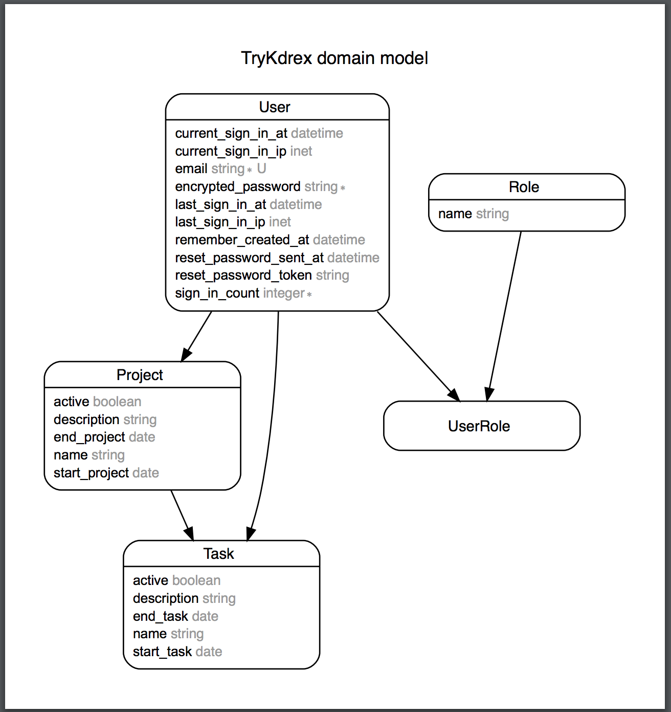

[**Ver en linea**](https://try-kdrex.herokuapp.com/) 

* Ruby version : 2.3.0

* Rails 4.2.5

* Postgres 9.6

* Usuario admnistrador: wolfsupremeshop@gmail.com
* password: 123456
* los usuario que se registran, por defecto tienen el rol de trabajador.
* Notificaciones al trabajador que se le asigna una tarea
* [Mailer configurado, solo funciona en este link](https://try-kdrex.herokuapp.com/)

**Modelos de datos**

